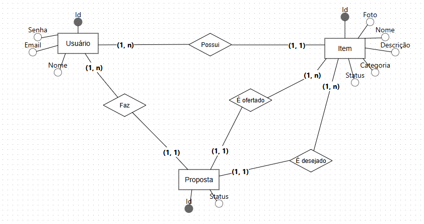
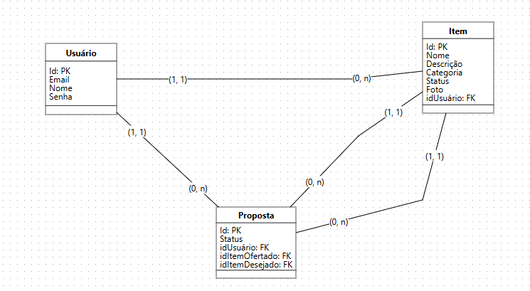

# Feira de Trocas Comunitária - Backend

### **1. Visão Geral**

API backend para a "Feira de Trocas Comunitária", um projeto prático do Bootcamp FullStack da Avanti. O sistema visa facilitar a troca de itens entre usuários, promovendo consumo consciente e laços comunitários.

### **2. Tecnologias**

* Node.js
* Express.js
* Prisma ORM
* PostgreSQL
* Cloudinary: Serviço de gerenciamento de mídia em nuvem para upload e hospedagem de imagens.
* Multer: Middleware para Node.js que lida com upload de arquivos (`multipart/form-data`).
* Bcryptjs: Biblioteca para hash de senhas de forma segura.
* JSON Web Token (JWT): Para autenticação de usuários e proteção de rotas.

### **3. Modelagem de Dados**

O banco de dados é composto pelas entidades:

* **Usuario**: Gerencia informações dos usuários. Inclui campos como `nome`, `email`, `senha` (hashada e obrigatória), e `isAdmin` (booleano, `false` por padrão).
* **Item**: Representa os objetos disponibilizados para troca. Contém `nome`, `descricao`, `categoria`, `status` (`Disponível`, `Trocado`), `URL da foto`, e `usuarioResponsavelId` (FK para `Usuario`).
* **Proposta**: Gerencia as solicitações de troca entre dois itens e usuários envolvidos. Possui `status` (pendente, aceita, recusada), `itemOfertadoId` (FK para Item), `itemDesejadoId` (FK para Item), e `quemFezId` (FK para Usuario).

### Diagramas do Modelo de Dados

Para uma visualização clara da estrutura do banco de dados e dos relacionamentos entre as entidades, consulte os diagramas abaixo:

#### Modelo Conceitual

*(Este diagrama representa a visão das entidades e seus relacionamentos, focando nos conceitos do negócio.)*



#### Modelo Lógico

*(Este diagrama detalha a estrutura das tabelas no banco de dados, incluindo chaves primárias (PK) e estrangeiras (FK), conforme implementado no Prisma.)*



### **4. Como Rodar o Backend**

### Pré-requisitos: Node.js, npm, PostgreSQL.

1.  **Clonar:** `git clone https://github.com/souzagabs/back_time7.git`
2.  **Instalar:** `npm install` (Isso instalará todas as dependências, incluindo `cloudinary`, `multer`, `bcryptjs`, `jsonwebtoken`, `dotenv`).
3.  **Configurar `.env`:** Crie um arquivo `.env` na raiz do projeto e preencha com as seguintes variáveis:
    ```
    DATABASE_URL="postgresql://<USUARIO>:<SENHA>@localhost:5432/<NOME_DB>"
    CLOUDINARY_CLOUD_NAME="seu_cloud_name_aqui"
    CLOUDINARY_API_KEY="sua_api_key_aqui"
    CLOUDINARY_API_SECRET="sua_api_secret_aqui"
    SECRET_KEY="sua_chave_secreta_para_jwt_aqui_bem_longa_e_aleatoria"
    ```
    * `DATABASE_URL`: String de conexão para o seu banco de dados PostgreSQL local.
    * `CLOUDINARY_*`: Credenciais da sua conta Cloudinary (obtidas no Dashboard Cloudinary).
    * `SECRET_KEY`: Uma string longa e aleatória que você mesmo cria para a assinatura dos JWTs.
4.  **Migrar DB:** `npx prisma migrate reset` (irá apagar **TODOS** os dados de desenvolvimento e recriar o schema).
5.  **Gerar Prisma Client:** `npx prisma generate`.
6.  **Iniciar:** `npm run dev` (desenvolvimento com `nodemon`) ou `npm start` (produção). O servidor estará rodando em `http://localhost:8084` (ou na porta configurada).

### **5. Endpoints da API**

Todos os endpoints seguem a estrutura MVC. Rotas protegidas por autenticação JWT (requerem `Authorization: Bearer <token>`).

* **Autenticação (`/login`):**

| Método | Rota      | Descrição                                  |
| :----- | :-------- | :----------------------------------------- |
| POST   | `/login`  | Realiza o login e retorna um JWT válido. |

* **Usuários (`/usuarios`):**

| Método | Rota              | Descrição                                                 | **Proteção** |
| :----- | :---------------- | :-------------------------------------------------------- | :----------------- |
| POST   | `/usuarios`       | Cria novo usuário (registro).                             | Pública            |
| GET    | `/usuarios`       | Lista todos os usuários.                                  | Pública            |
| GET    | `/usuarios/:id`   | Detalhes de usuário específico.                           | Pública            |
| PUT    | `/usuarios/:id`   | Atualiza usuário existente (requer autenticação e autorização do próprio usuário ou admin). | Protegida / Autorizada |
| DELETE | `/usuarios/:id`   | Exclui usuário (requer autenticação e autorização do próprio usuário ou admin). | Protegida / Autorizada |

* **Itens (`/itens`):**

| Método | Rota              | Descrição                                                         | **Proteção** |
| :----- | :---------------- | :---------------------------------------------------------------- | :----------------- |
| POST   | `/itens`          | Cadastra um novo item (requer autenticação).                      | Protegida          |
| GET    | `/itens`          | Lista todos os itens disponíveis (com filtros e busca).           | Pública            |
| GET    | `/itens/:id`      | Detalhes de um item específico.                                   | Pública            |
| PUT    | `/itens/:id`      | Atualiza um item existente (requer autenticação e autorização do dono ou admin). | Protegida / Autorizada |
| DELETE | `/itens/:id`      | Exclui um item (requer autenticação e autorização do dono ou admin). | Protegida / Autorizada |

* **Propostas (`/propostas`):**

| Método | Rota                      | Descrição                                                            | **Proteção** |
| :----- | :------------------------ | :------------------------------------------------------------------- | :----------------- |
| POST   | `/propostas`              | Cria uma nova proposta de troca (requer autenticação).               | Protegida          |
| GET    | `/propostas`              | Lista todas as propostas (com filtros por status, proponente, item desejado). | Protegida / Autorizada |
| GET    | `/propostas/:id`          | Detalhes de uma proposta específica (requer autenticação e autorização). | Protegida / Autorizada |
| PUT    | `/propostas/:id/aceitar`  | Aceita uma proposta de troca (requer autenticação e autorização do dono do item desejado ou admin). | Protegida / Autorizada |
| PUT    | `/propostas/:id/recusar`  | Recusa uma proposta de troca (requer autenticação e autorização do dono do item desejado ou admin). | Protegida / Autorizada |
| DELETE | `/propostas/:id`         | Exclui uma proposta (requer autenticação e autorização do proponente, dono do item desejado ou admin). | Protegida / Autorizada |

* **Uploads (`/uploads`):**

| Método | Rota              | Descrição                                                         | **Proteção** |
| :----- | :---------------- | :---------------------------------------------------------------- | :----------------- |
| POST   | `/uploads/upload` | Realiza o upload de uma imagem para o Cloudinary e retorna sua URL. | Protegida          |

**Observação sobre o Upload:**
    
    Para associar uma imagem a um item, primeiro faça o `POST` para `/uploads/upload`. Em seguida, utilize a `imageUrl` retornada por este endpoint no campo `foto` ao criar ou atualizar um item via `POST /itens` ou `PUT /itens/:id`.

### **6. Coleção do Insomnia para Testes**

Para facilitar os testes manuais dos endpoints da API, a coleção do Insomnia está disponível neste repositório.

**Como Importar:**

    1. Faça o download do arquivo `feira-de-trocas-collection.json` localizado em `docs/insomnia/`.
    2. No Insomnia, vá em `File > Import From File` e selecione o arquivo baixado.
    3. Escolha "Import as a new Collection".

### **7. Contribuições da Equipe**

    Anderson Oliveira de Sousa: Desenvolveu os schemas que seriam usados no codigo, atuou também nas etapas de teste da api e revisão final do código.

    Davi José Lima de Sousa: Atuou nas etapas de teste da API, colaborou com sugestões de melhoria e participou das discussões técnicas da equipe.

    Daiane Rocha: Contribuiu com os testes da aplicação, participou das discussões de equipe e deu suporte no alinhamento das tarefas.

    Gabriel de Souza Brasil: Responsável pela estruturação inicial do projeto, lógica principal da aplicação e organização do repositório backend. Desenvolveu os controllers de login, implementou o sistema completo de autenticação e autorização com JWT, incluindo hash de senhas com bcrypt, rotas autenticadas e áreas com acesso restrito via validação de permissões (isAdmin). Também configurou o uso de variáveis de ambiente com `.env` para gerenciamento da `SECRET_KEY`, além de contribuir com ajustes finais e suporte à equipe durante o desenvolvimento.